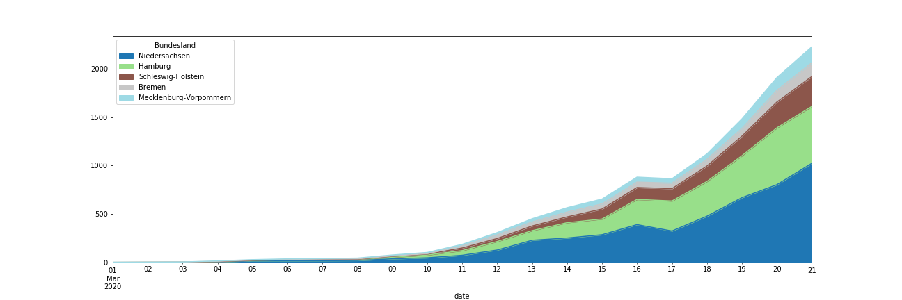
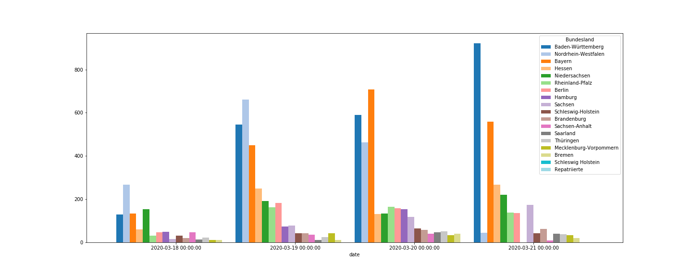

# covid19-timeseries-germany-by-state

This juypter notebooks gathers historical data for COVID-19 (Corona) cases in Germany. 

Currently there is no historical timeseries data available for German states. Only daily snapshots are provided. With help of the Wayback machine a time series is reconstructed. I hope this may help someone.

---
Here are some samples:

## Infections by state

## Simplistic forecast model

## Infections in northern Germany

## Daily increases in infections by state

